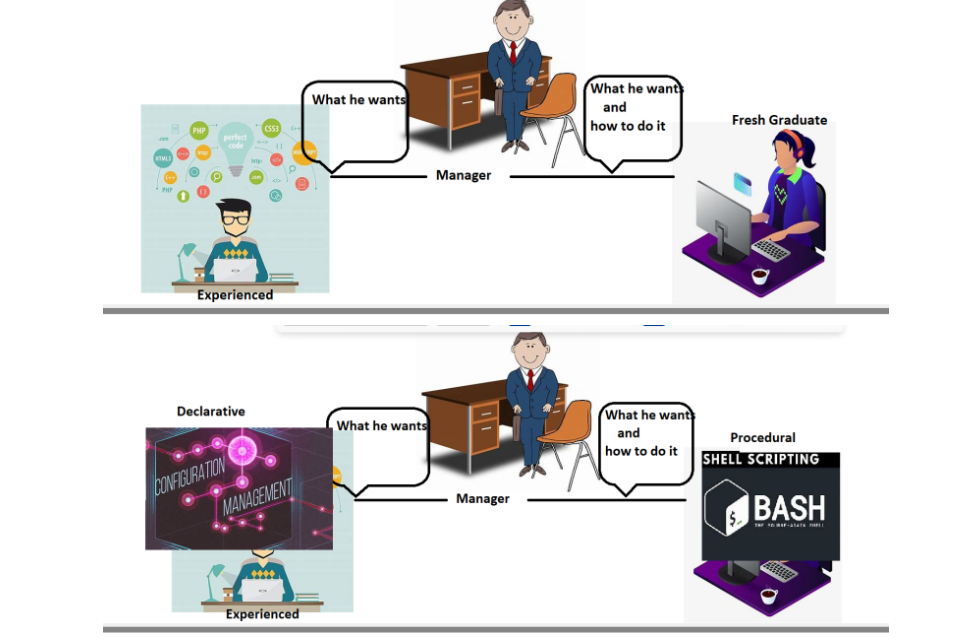
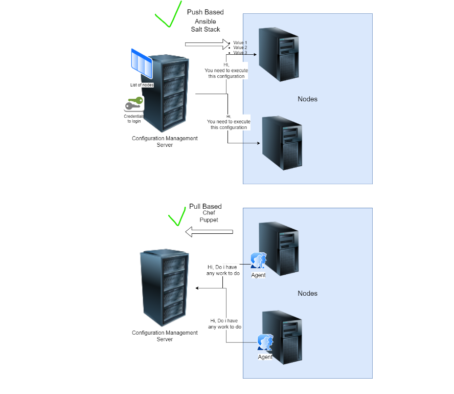
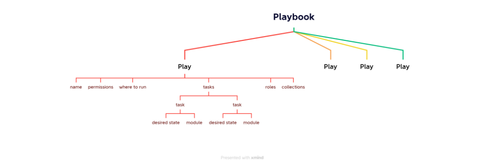

# deployment options

* Declarative vs Procedural
* 
* Configuration Management is all about declarative deployment of applications which ensures
   * idempotence: Run this once or n times you will have same result
   * Desired state: We express configuration to acheive a desired state.
   * reusable
# Configuration Management (CM)
Configuration Management is all about declarative deployment of applications which ensures
   * idempotence: Run this once or n times you will have same result
   * Desired state: We express configuration to acheive a desired state.
* Direction of Communication
   * PULL => Node to CM server
   * Push => CM Server to Node
* Ansible is a configuration management platform that automates storage, servers, and networking. When you use Ansible to configure these components, difficult manual tasks become repeatable and less vulnerable to error.
* There are two types of CM
Pull based CM:
--------------
* In this type of configuration management tool, the nodes pull the configuration information from the server (hence, the name).A small software (called agent or client) is installed on every node.
* This agent/client will:at regular intervals, get the configuration from the server compare the configuration received from the server with the current configuration of the node, if there is any mis-match, take the steps required to match the configuration of the node with the configuration received from the server.
  * Chef & 
  * Puppet are good examples for pull based configuration management tools.

Push Based CM:
-------------- 
* In this type of configuration management tool, the main server (where the configuration data is stored) pushes the configuration to the node (hence, the name). So, it is the main server that initiates communication, not the nodes. Which means that an agent/client may or may not be installed on each node.
  * Ansible & 
  * SaltStack are good examples for push based configuration management tools.
* What is required in PULL Based CM?
  * Agent needs to be installed with necessary credentials to connect to CM Server
* What is required in Push Based CM
  * List of nodes (inventory)
  * Credentials to login into node
Architecture of Ansible
------------------------
* Ansible works by connecting to your nodes and pushing out scripts called “Ansible modules” to them. Most modules accept parameters that describe the desired state of the system. Ansible then executes these modules (over SSH by default), and removes them when finished. Your library of modules can reside on any machine, and there are no servers, daemons, or databases required.

* Ansible control node can execute desired state on nodes using
    * adhoc commands
    * playbooks
* Playbooks are YAML files.

# How Operations Team work on multiple servers
* Organizations will have lot of servers and lot of admins
* Creating individual logins on each server for every admin is not a feasible solution.
* An effective way is organization creates a service account for the admins to login and   perform administration.

* For the lab activities our service account’s name would be devops
* Having username and password is not a sensible option then how to solve this problem

# How to setup key pair based authentication in linux machines
* Key pair is combination of two keys public and private using alogrithms, we will be using RSA
* Create a key pair ``ssh-keygen``
* after that Copy the public key to linux machine <ssh-copy-id username@ipaddress> example``ssh-copy-id devops@172.168.123.11``
* connect to the machine using private key ``ssh -i <path-to-private key> username@ipaddress``
* Generally private keys created will have extension of .pem
* i.e we create a Service account public and private key. Copy the service account public key to all the servers. disable password based authentication
# Setting up sudo permissions
* We need to add devops user to the sudoers group (Wheel)
* Execute ``sudo visudo``in that insert`` devops ALL=(ALL:ALL) NOPASSWD:ALL``
* Environment
* We need atleast two linux machines
    * one is Ansible control node
    * others is/are nodes
* We will be creating a service account called as devops in all machines
* We will be creating a key pair in Ansible control node
* Copy the public key into the nodes
* Optional: Disable password based authentication

# Installing and Configuring Ansible
We will create two ubuntu vms
Create a user called devops in two vms with sudo permissions
Create a key-pair in ansible control node & copy the public key to other vm from ansible control node
* Installing ansible
```
sudo apt install software-properties-common -y
sudo add-apt-repository --yes --update ppa:ansible/ansible
sudo apt install ansible -y
```
* Verify ansible version ``ansible --version``
* Now lets add inventory. Create a file called as ``vi hosts`` with one entry <ipaddress>
* Check connectivity by executing ``ansible -i hosts -m ping all``
# Note:
* To enable password authentications edit config ``sudo vi /etc/ssh/sshd_config`` and set PasswordAuthentication to yes from no.
* restart sshd service ``sudo service sshd restart``

# Ansible
Ansible can communicate with nodes by using two approaches
1. adhoc commands:
* We build a command for desired state
* It's not reuseable,and it is used for quick teast and changes
* it is used for a single task execute quickly,it's running without write a playbook.

# playbook:
* We create a file where we express desired state
* This is recommended approach for repetitive activites

* We have taken a sample playbook
```yml
---
- name: hello ansible
  hosts: all
  become: yes
  tasks:
    - name: update packages and install tree
      apt:
        name: tree
        state: present
        update_cache: yes
```
* Basic Playbook semantics

* In ansible the smallest unit of work is perfomed by "module"

# YAML
* YAML vs JSON

Refer Here for yaml syntax from ansible
# Ways of Working (WoW):
* list down all the manual steps
* Ensure all the steps are working
* For each step find a module and express the desired state
# Activity 1: Install apache server
* Manual steps
```
sudo apt update
sudo apt install apache2 -y
```
* Verify the installation in new tab ``http://<public-ip>``
* [ReferHere](https://docs.ansible.com/ansible/latest/playbook_guide/playbooks_intro.html) for ansible yaml syntax for playbook
* Finding the module:
    * search google with <command> in ansible, example command name copy or search "wget module in ansible"
    * search from ansible modules docs [ReferHere](https://docs.ansible.com/ansible/2.9/modules/modules_by_category.html)
* all the commands for installation are executed with sudo so we can give ``become: yes`` in playbook.
* create inventory``vi hosts``
* Run the command ansible-playbook -i <inventory-path> <playbook-path>
* If we create 2directories with names inventory and playbook we need to give path otherwise we can run playbook directly.

