# DevOps Classroomnotes Ansible(23/May/2023 to june14/2023)
* Example Application: Story of ToyCraft
* ToyCraft is an enterprise which is global and famous for its cheap toys
* This application is accessed globally.
* The architecture of the application is as follows

* Every 15 days toycraft gives a new release and it has to update in all the servers.
* Toycraft has minimum one deployment per country.
* Toycraft is available in 15 countries.
* To do this i have 3 possible options
# deployment options

* Declarative vs Procedural
* 
* Configuration Management is all about declarative deployment of applications which ensures
   * idempotence: Run this once or n times you will have same result
   * Desired state: We express configuration to acheive a desired state.
   * reusable
# Configuration Management (CM)
Configuration Management is all about declarative deployment of applications which ensures
   * idempotence: Run this once or n times you will have same result
   * Desired state: We express configuration to acheive a desired state.
* Direction of Communication
   * PULL => Node to CM server
   * Push => CM Server to Node
* Ansible is a configuration management platform that automates storage, servers, and networking. When you use Ansible to configure these components, difficult manual tasks become repeatable and less vulnerable to error.
* There are two types of CM

# Pull based CM:
--------------
* In this type of configuration management tool, the nodes pull the configuration information from the server (hence, the name).A small software (called agent or client) is installed on every node.
* This agent/client will at regular intervals, get the configuration from the server compare the configuration received from the server with the current configuration of the node, if there is any mis-match, take the steps required to match the configuration of the node with the configuration received from the server.
  * Chef & 
  * Puppet are good examples for pull based configuration management tools.


# Push Based CM:
-------------- 
* In this type of configuration management tool, the main server (where the configuration data is stored) pushes the configuration to the node (hence, the name). So, it is the main server that initiates communication, not the nodes. Which means that an agent/client may or may not be installed on each node.
  * Ansible & 
  * SaltStack are good examples for push based configuration management tools.
* What is required in PULL Based CM?
  * Agent needs to be installed with necessary credentials to connect to CM Server
* What is required in Push Based CM
  * List of nodes (inventory)
  * Credentials to login into node

# Architecture of Ansible
------------------------
* Ansible works by connecting to your nodes and pushing out scripts called “Ansible modules” to them. Most modules accept parameters that describe the desired state of the system. Ansible then executes these modules (over SSH by default), and removes them when finished. Your library of modules can reside on any machine, and there are no servers, daemons, or databases required.

* Ansible control node can execute desired state on nodes using
    * adhoc commands
    * playbooks
* Playbooks are YAML files.

# How Operations Team work on multiple servers
* Organizations will have lot of servers and lot of admins
* Creating individual logins on each server for every admin is not a feasible solution.
* An effective way is organization creates a service account for the admins to login and perform administration.

* For the lab activities our service account’s name would be devops
* Having username and password is not a sensible option then how to solve this problem

# How to setup key pair based authentication in linux machines
* Key pair is combination of two keys public and private using alogrithms, we will be using RSA
* First execute this command in all nodes (ACN) and another nodes ``sudo apt update``
* Then give the password authntication yes from no ``sudo vi /etc/ssh/sshd_config``
* 
* Next restart the sshd ``sudo systemctl restart sshd``
* 
* create the user ``sudo adduser <username>`` ``sudo adduser devops``
* Next give the sudo permissions ``sudo visudo``
* Create a key pair ``ssh-keygen``
* 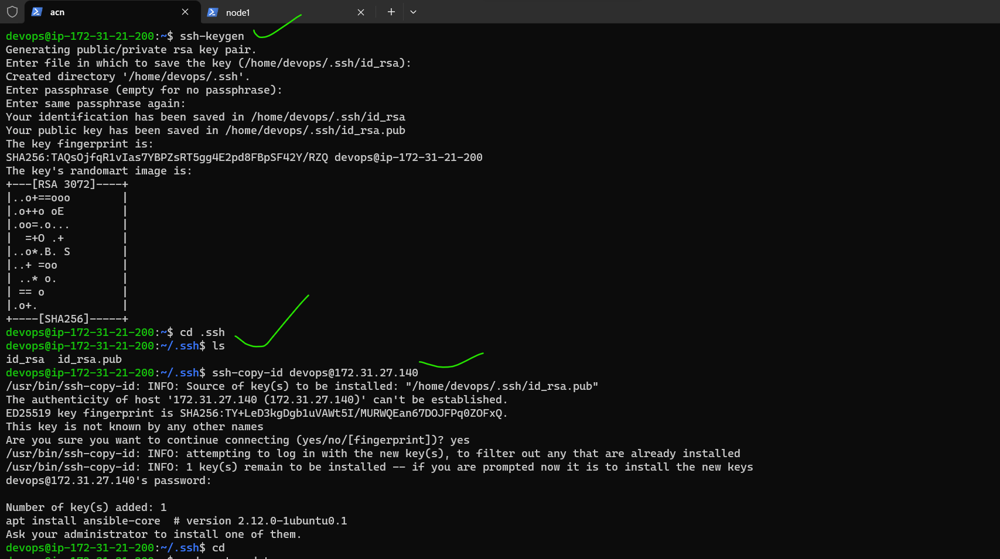
* After that Copy the public key to linux machine <ssh-copy-id username@ipaddress> example``ssh-copy-id devops@172.168.123.11``
* connect to the machine using private key ``ssh -i <path-to-private key> username@ipaddress``
* Generally private keys created will have extension of .pem
* i.e we create a Service account public and private key. Copy the service account public key to all the servers. disable password based authentication
# Setting up sudo permissions
* We need to add devops user to the sudoers group (Wheel)
* Execute ``sudo visudo``in that insert`` devops ALL=(ALL:ALL) NOPASSWD:ALL``
* 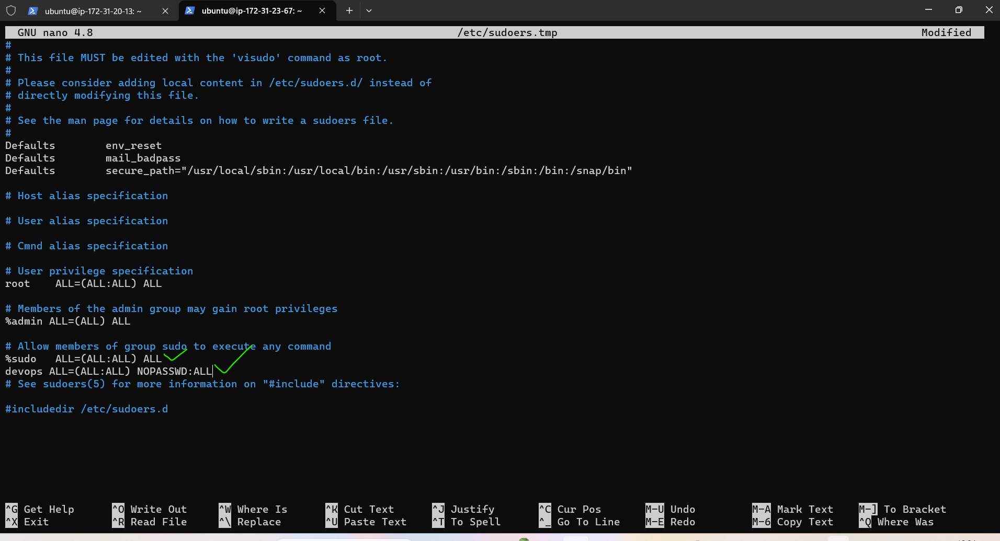
# Environment
* We need atleast two linux machines
    * one is Ansible control node
    * others is/are nodes
* We will be creating a service account called as devops in all machines
* We will be creating a key pair in Ansible control node
* Copy the public key into the nodes
* Optional: Disable password based authentication

# Installing and Configuring Ansible
* We will create two ubuntu vms
* Create a user called devops in two vms with sudo permissions
* Create a key-pair in ansible control node & copy the public key to other vm from ansible control node

Installing ansible
------------------
```
sudo apt install software-properties-common -y
sudo add-apt-repository --yes --update ppa:ansible/ansible
sudo apt install ansible -y
```
* Verify ansible version ``ansible --version``
* Now lets add inventory. Create a file called as ``vi hosts`` with one entry <ip address>
* Check connectivity by executing ``ansible -i hosts -m ping all``
* 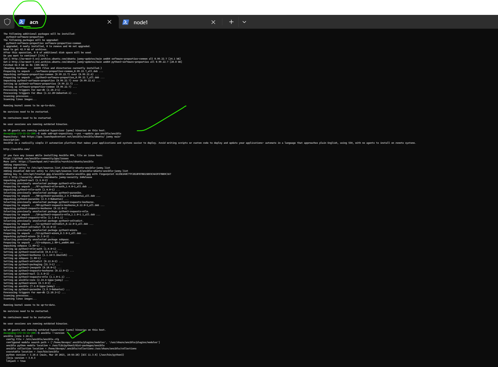
* 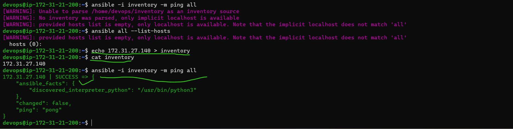
# Note:
* To enable password authentications edit config ``sudo vi /etc/ssh/sshd_config`` and set PasswordAuthentication to yes from no.
* restart sshd service ``sudo service sshd restart``
* 

# Ansible
Ansible can communicate with nodes by using two approaches
1. adhoc commands:
* We build a command for desired state
* It's not reuseable,and it is used for quick test and changes
* It is used for a single task execute quickly,it's running without write a playbook.

# playbook:
* We create a file where we express desired state
* This is recommended approach for repetitive activites

* We have taken a sample playbook
```yml
---
- name: hello ansible
  hosts: all
  become: yes
  tasks:
    - name: update packages and install tree
      apt:
        name: tree
        state: present
        update_cache: yes
```
* Basic Playbook semantics

* In ansible the smallest unit of work is perfomed by "module"

# YAML
* YAML vs JSON

Refer Here for yaml syntax from ansible
# Ways of Working (WoW):
* list down all the manual steps
* Ensure all the steps are working
* For each step find a module and express the desired state
# Activity 1: Install apache server
* Manual steps
```
sudo apt update
sudo apt install apache2 -y
```
* Verify the installation in new tab ``http://<public-ip>``
* [ReferHere](https://docs.ansible.com/ansible/latest/playbook_guide/playbooks_intro.html) for ansible yaml syntax for playbook
* Finding the module:
    * search google with ``<command>`` in ansible, example command name copy or search "wget module in ansible"
    * search from ansible modules docs [ReferHere](https://docs.ansible.com/ansible/2.9/modules/modules_by_category.html)
* all the commands for installation are executed with sudo so we can give ``become: yes`` in playbook.
* create inventory``vi hosts``
* Run the command ``ansible-playbook -i <inventory-path> <playbook-path>``
* If we create 2directories with names inventory and playbook we need to give path otherwise we can run playbook directly.


# Activity 2: Installing lamp server on ubuntu
* Note: we will skip mysql installation for now
* Manual steps are
```
sudo apt update
sudo apt install apache2 -y
sudo apt install php libapache2-mod-php php-mysql -y
# Create a file called as /var/www/html/info.php with below content
# <?php phpinfo(); ?>
sudo -i
echo '<?php phpinfo(); ?>' > /var/www/html/info.php
exit
sudo systemctl restart apache2
```
* Refer in my ansible yamlfiles folder for the changeset containing playbook(php.yaml), inventory and file
* Check for syntax of playbook ``ansible-playbook -i <inventory-path> --syntax-check <playbook-path>``
* Now lets run the playbook ``ansible-playbook -i <inventory-path> <playbook-path>``
* Verify the installation with ``<IPaddress>/info.php``
* Problems to be addressed
    * during every playbook execution the apache service is getting restarted
* 
* 
* 
* 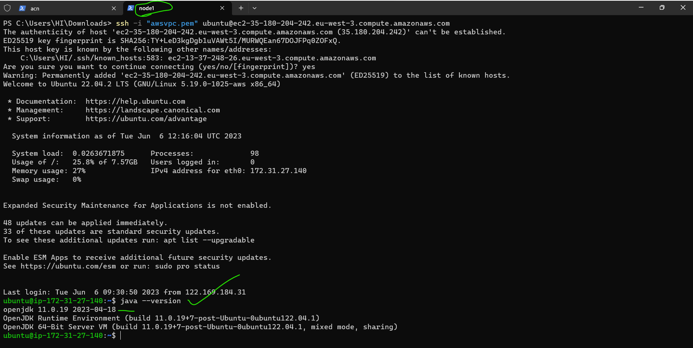
* 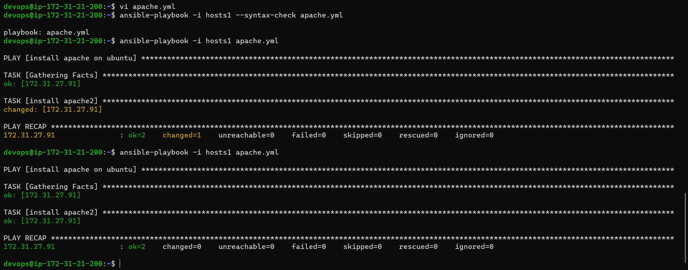
* 
* 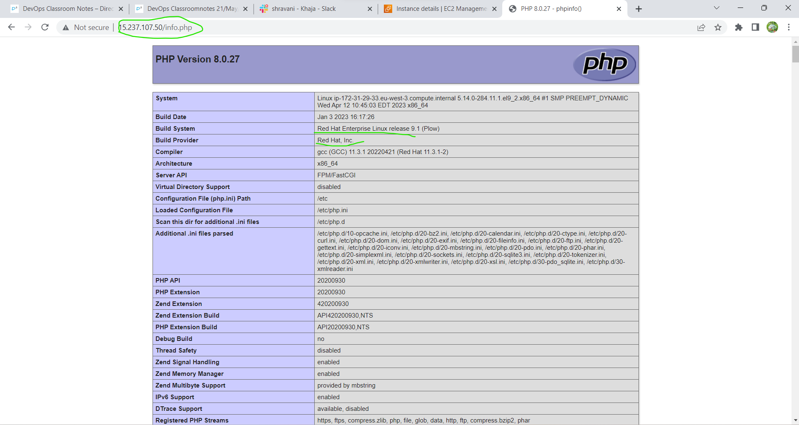
# Activity 3: Install lamp stack on Redhat 9
* Manual steps
```
sudo yum install httpd -y
sudo systemctl enable httpd
sudo systemctl start httpd
sudo yum install php -y
sudo -i
echo '<?php phpinfo(); ?>' > /var/www/html/info.php
exit
sudo systemctl restart httpd
```
* Refer in my ansible yamlfiles folder for the changeset containing playbook(redhat.yaml)
* 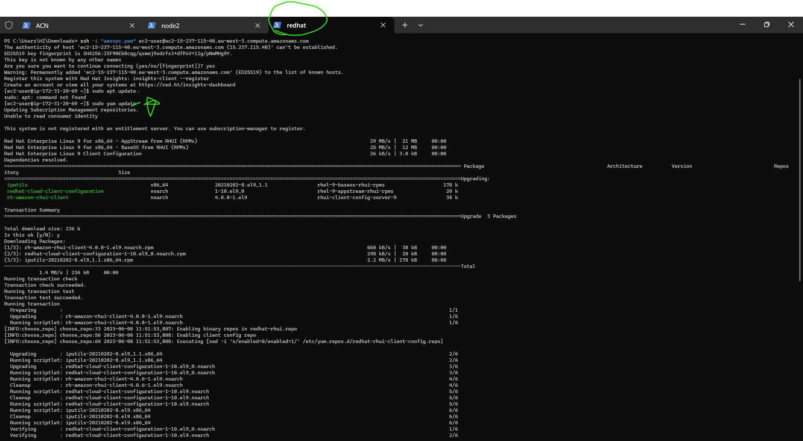
* 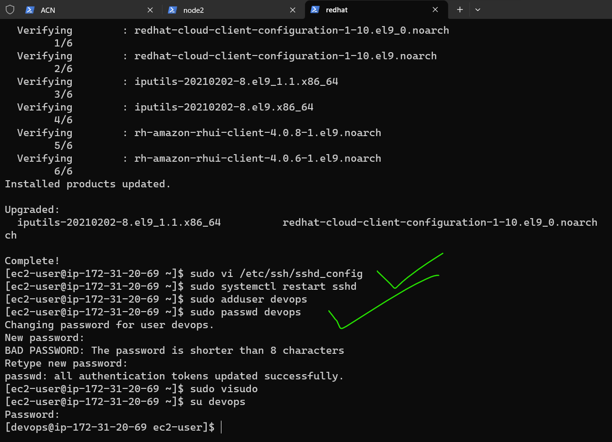
* 
* 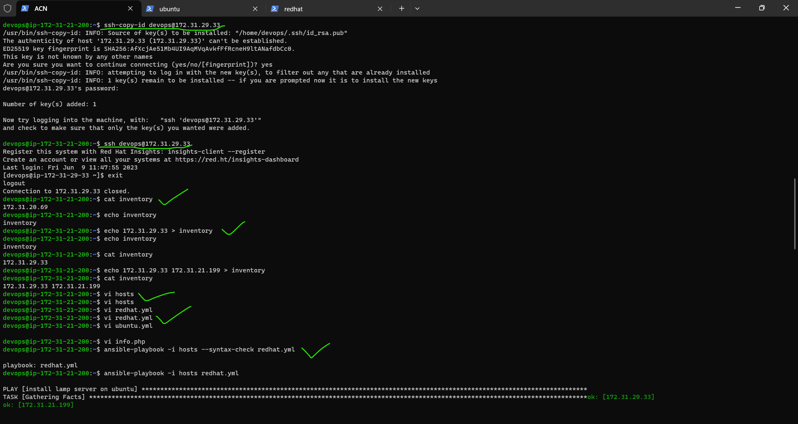
* 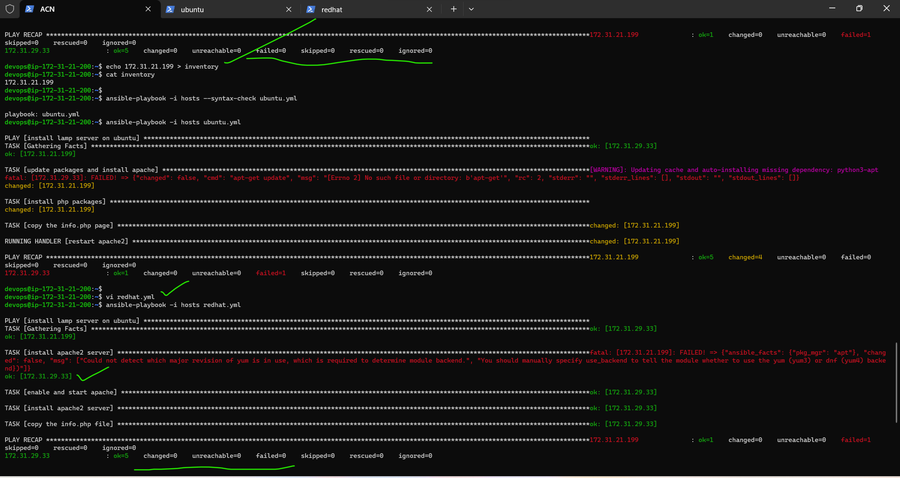
* 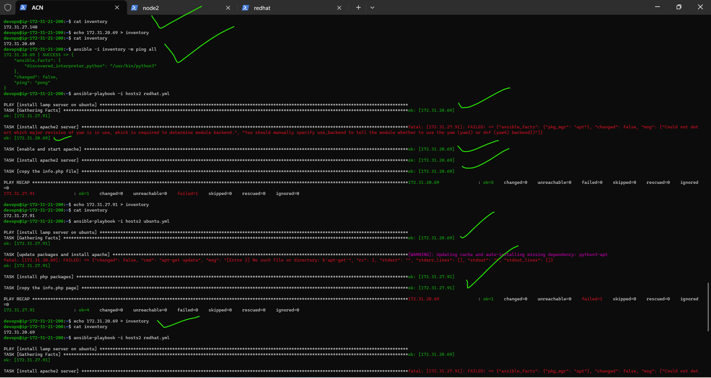
* 
* Problems
    * during every playbook execution the apache service is getting restarted
    * Why should we have two inventory files one for ubuntu and one for redhat
    * Can we have one playbook for both redhat and ubuntu
    * Bailout with proper failure message for unsupported operating systems

# Ansible Handlers
* Handlers: Handlers are tasks that only run when notified.
* For the documentation [ReferHere](https://docs.ansible.com/ansible/latest/playbook_guide/playbooks_handlers.html#handlers)
* Refer in my yamlfiles handlers folder for the changes with handlers included
* Info.php copying step changed i.e. copied the file to meet desired state so restart executed
* Info.pyhp copying step was ok i.e. desired state is met so task did nothing, so restart not executed
* Inventory in Ansible represents the hosts which we need to connect to.
* Ansible inventory is broadly classified into two types
   * static inventory: where we mention the list of nodes to connect to in some file
   * dynamic inventory: where we mention some script/plugin which will dynamically find    out the nodes to connect to
* As of now lets focus on static inventory
* [Refer Here](https://docs.ansible.com/ansible/latest/inventory_guide/intro_inventory.html#inventory-basics-formats-hosts-and-groups) for official docs on Ansible inventory
* Static inventory can be mentioned in two formats
      ini
      yaml
* Ini format: In this format we can use commands with -i means inventory use that inventory file we can mentioned the details of web servers and app servers in that.
* command is ``ansible-playbook -i <inventorypath> <playbook path>``
* To check the list of hosts ``ansible-playbook -i <inventorypath> <playbook path> --list-hosts``
* example ``ansible-playbook -i inventory/hosts yamlfiles/handlers/ubuntu.yaml``
* Refer for the changes to include groups and same inventory across redhat and ubuntu instances in my yamlfiles =>handlers=>hosts

* YAML format:
* for the inventory in yaml format
```
---
all:
  children:
    ubuntu:
      hosts:
        172.31.27.136:
    redhat:
      hosts:
        172.31.23.22:
    webserver:
      hosts:
        172.31.27.136:
        172.31.23.22:
```
# Facts:
* If we want to execute or skip a task based on facts. Facts are attributes of individual hosts, including IP address, operating system, the status of a filesystem, and many more. With conditionals based on facts.
* ansible collects information about the node on which it is executing by the help of module called as setup
* Ansible playbook by default collects information about nodes where it is executing, we can use this with the help of variables
* Collecting information can be disabled as well
```yaml
---
- name: do something
  hosts: all
  gather_facts: no
  ...
  ...
```
* In the playbook the facts will be collected and will be available in a special variables ``ansible_facts``
* Consider the below playbook
```yml
---
- name: exploring facts
  become: no
  hosts: all
  tasks:
    - name: print os details
      ansible.builtin.debug:
        msg: "family: {{ ansible_facts['os_family'] }} distribution: {{ ansible_facts['distribution'] }}"
```
* The statement ``ansible_facts['os_family']`` represents accessing os family from the facts collected
* From facts the variables can be accessed with full names ``ansible_default_ipv4`` or ``ansible_facts['default_ipv4']``
```yml
---
- name: exploring facts
  become: no
  hosts: all
  tasks:
    - name: print os details
      ansible.builtin.debug:
        var: ansible_default_ipv4
    - name: same info
      ansible.builtin.debug:
        var: ansible_facts['default_ipv4']
```        
* Lets apply conditionals to ansible playbook [ReferHere](https://docs.ansible.com/ansible/latest/playbook_guide/playbooks_conditionals.html)
* Refer for the changeset in my ansible=>yamlfiles=>handlers=>combined.yaml
* Explore
* Explore the verbosity levels of execution i.e -v, -vv , -vvv ..
* Write an ansible adhoc command to install git on node1
```
sudo apt install git
sudo yum install git
```
# Ansible Variables
* Ansible uses variables to manage differences between systems. With Ansible, you can execute tasks and playbooks on multiple different systems with a single command. To represent the variations among those different systems, you can create variables with standard YAML syntax, including lists and dictionaries. You can define these variables in your playbooks, in your inventory, in re-usable files or roles, or at the command line. You can also create variables during a playbook run by registering the return value or values of a task as a new variable.
* [ReferHere](https://docs.ansible.com/ansible/latest/playbook_guide/playbooks_variables.html) for the official docs on variables
* Refer in my ansible=>yamlfiles=>handlers=>hosts changeset containing variables
* Lets use a generic package manager package [ReferHere](https://docs.ansible.com/ansible/latest/collections/ansible/builtin/package_module.html)
* Refer for the changeset where we used package instead of apt/yum for install apache in my ansible=>yamlfiles=>handlers=>combined_red_ubuntu.yaml
* variables at the inventory level need not be in inventory file means we are create variables in inventory file but specielly no need to inventory file for variables.
* Refer for the debug messages in my ansible=>yamlfiles=>handlers=>combined_red_ubuntu.yaml
* [Refer Here](https://docs.ansible.com/ansible/latest/playbook_guide/playbooks_loops.html) for loops in ansible
* Refer the changeset with loops and using loops from variables in my ansible=>yamlfiles=>handlers=>combined_red_ubuntu.yaml

# tomcat installation
* Lets try to install tomcat without using package manager
* [Refer Here](https://linuxize.com/post/how-to-install-tomcat-10-on-ubuntu-22-04/) for manual steps for installing tomcat 10 on ubuntu 22.04
* In tomcat installation in the useradd command -d stands for home directory
* group variables are added in group vars folder for example tomcat is my group name so in the ``host : tomcat`` and group vars added in tomcat.yml
```yml
---
java_package: openjdk-11-jdk
```
* And in the hosts file also changed group name tomcat
```
[tomcat]
172.31.27.136 
```
* for explanation of this command``sudo useradd -m -U -d /opt/tomcat -s /bin/false tomcat``
# use this command ``useradd --help`` in that all arguments are there
* -d (--home)(/home)
* -G (--groups)
* -s (--shell)
* -g (--gid)(groupid)
* -u (--uid)(userid)
* -m (--create-home)user’s home directory(/home/username)
* -D (--defaults)
* -e (--expiredate)
* -c (--comment) #Creating a User with Custom Comment
* -p password
* -U (--user-group)

* Based on manual commands we can search in google ansible modules(example:user module in ansible, group module in ansible)after that based on parameters we will write the playbook.
* And if needed we can create variables for that in tomcat.yml(it's for variables)
* write the playbook for each task step by step with use of modules. 
* Downloading tomcat into temp directory with use of get_url module,in this we have to use destination(dest:/tmp/apache)
* For the changes to extract tomcat we can use unarchive module, in this module having src& dest, and we can give remote_src: yes beacause give permission to root directory.
* For the symlink changes we can use file module in that (state: link )parameters are there[ReferHere](https://docs.ansible.com/ansible/2.9/modules/file_module.html#synopsis)
* For changes to change home directory ownership we can use file module again but in this we use recurse parameters see once above referhere link in that recurese option is there it is used for only state: directory.
* Lets directly run the linux command form ansible. This is not idempotent.
* The shell module takes the command name followed by a list of space-delimited arguments.
* Either a free form command or cmd parameter is required, see the examples.
    * example :
    - name: Add execute permissions for shell scripts
      ansible.builtin.shell:
        cmd: "chmod +x {{ homedir }}/latest/bin/*.sh"
* For that we can use shell module in that we can use cmd parameter [ReferHere](https://docs.ansible.com/ansible/latest/collections/ansible/builtin/shell_module.html)
* We need to create a service file but it has dynamic content, so copying static file is not an option, Ansible has templating
     * for expressions we use jinja templates [Refer Here](https://docs.ansible.com/ansible/latest/playbook_guide/playbooks_templating.html)
     * for module we use template module [Refer Here](https://docs.ansible.com/ansible/latest/collections/ansible/builtin/template_module.html)
* example:
    - name: copy the service file
      ansible.builtin.template:
        src: tomcat.service.j2
        dest: /etc/systemd/system/tomcat.service
      notify:
        - reload daemon
* In that service file we can copy the service file content and paste it in same folder VCS(visualstudiocode)
* This should bring up the tomcat server
* [Refer Here](https://github.com/asquarezone/AnsibleZone/commit/dec9bb66635ba0a1823f98403de2e17fa38e8b9e)for the steps to configure tomcat management interface
* As of now we have written the playbook which works on ubuntu and installs tomcat

# Ansible Tags
* If you have a large playbook, it may be useful to run only specific parts of it instead of running the entire playbook. You can do this with Ansible tags. Using tags to execute or skip selected tasks is a two-step process:
   * Add tags to your tasks, either individually or with tag inheritance from a block,  play, role, or import.
   * Select or skip tags when you run your playbook.
* Ansible tags documentation[ReferHere](https://docs.ansible.com/ansible/latest/playbook_guide/playbooks_tags.html)

# Ansible Roles
* Roles
* Roles let you automatically load related vars, files, tasks, handlers, and other Ansible artifacts based on a known file structure. After you group your content in roles, you can easily reuse them and share them with other users.
* An Ansible role has a defined directory structure with eight main standard directories. You must include at least one of these directories in each role. You can omit any directories the role does not use. For example:
* playbooks
    site.yml
    webservers.yml
    fooservers.yml
* By default Ansible will look in each directory within a role for a main.yml file for relevant content (also main.yaml and main):

tasks/main.yml - the main list of tasks that the role executes.

handlers/main.yml - handlers, which may be used within or outside this role.

library/my_module.py - modules, which may be used within this role (see Embedding modules and plugins in roles for more information).

defaults/main.yml - default variables for the role (see Using Variables for more information). These variables have the lowest priority of any variables available, and can be easily overridden by any other variable, including inventory variables.

vars/main.yml - other variables for the role (see Using Variables for more information).

files/main.yml - files that the role deploys.

templates/main.yml - templates that the role deploys.

meta/main.yml - metadata for the role, including role dependencies and optional Galaxy metadata such as platforms supported.
* for the roles documentation [referhere](https://docs.ansible.com/ansible/latest/playbook_guide/playbooks_reuse_roles.html) 
* for role with tomcat 10 [ReferHere](https://github.com/asquarezone/AnsibleZone/tree/master/May23/roleusages)
* Role for installing phpinfo page for the changes [ReferHere](https://github.com/asquarezone/AnsibleZone/commit/45016d150335eccb4e3a4ec48c3d76984b3098fe)
* for calling the role
```yml
---
- name: install tomcat
  become: yes
  hosts: tomcat 
  roles:
    - tomcat10
```
* Lets use a role to install mysql
* Lets use the role Refer Here, so install it ``ansible-galaxy install robertdebock.mysql``

```yml
---
- name: Converge
  hosts: all
  become: yes
  gather_facts: yes
  roles:
    - role: robertdebock.mysql
      vars:
        mysql_bind_address: "0.0.0.0"
```        
# Ansible Collections
* collections are combination of reusable roles and modules
* in the collections we can create our ownmodule 
* Ansible collections are distribution format which include roles and modules
* [Refer Here](https://docs.ansible.com/ansible/latest/collections_guide/index.html) for offical docs
* [Refer Here](https://github.com/ansible-collections/community.mysql) for sample collection.
* only some oraganizations use this collections not everyone use, this is the rare case.

# Ansible Configurations
* Ansible on Windows
   * Connectivity method will be winrm [Refer Here](https://learn.microsoft.com/en-us/windows/win32/winrm/portal)
   * [Refer Here](https://directdevops.blog/2021/05/24/devops-classroom-series-23-may-2021/) for the classroom notes
   * [Refer Here](https://docs.ansible.com/ansible/latest/os_guide/windows_setup.html) for setting up windows host
   * Lets use some of the modules for windows [Refer Here](https://docs.ansible.com/ansible/2.9/modules/list_of_windows_modules.html)
Sample playbook
```yml
---
- name: install something on windows
  hosts: all
  tasks:
    - name: enable iis server
      win_feature:
        name: Web-Server
        include_management_tools: yes
        state: present
```