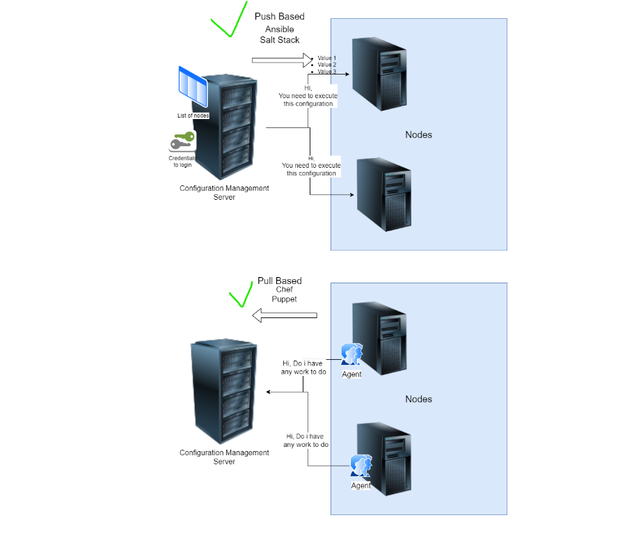
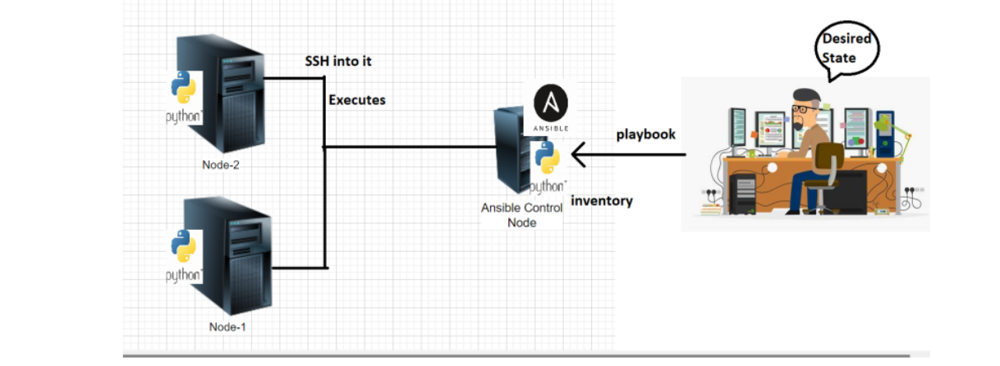
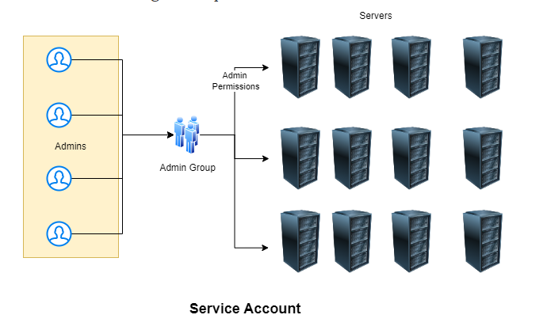

Ansible Interview Questions
----------------------------
# What is Ansible ?
* It is an open-source automation tool, or platform, used for IT tasks such as configuration management, application deployment, intraservice orchestration, and provisioning.
* Ansible is a tool written in Python, and it uses the declarative markup language YAML to describe the desired state of devices and configuration. In association with the idea of a "desired state," Ansible also uses the concept of idempotency.(Ansible it means after 1 run of a playbook to set things to the desired state, further runs of the same playbook should result in 0 changes.)[referhere](https://gauravtank2203.medium.com/idempotency-in-ansible-using-httpd-977239f99075)
* Function of Ansible roles allow you to develop reusable automation components by grouping and encapsulating related automation artifacts, like configuration files, templates, tasks, and handlers.
# What is a node in Ansible?
* Ansible control nodes are primarily used to run tasks on managed hosts. You can use any machine with Python installed as an Ansible control node. However, you cannot use Windows as an Ansible control node. Managed nodes: Hosts that you manage using Ansible.
Inventory: A list of managed nodes.
# Configuration Management (CM)
Configuration Management is all about declarative deployment of applications which ensures
   * idempotence: Run this once or n times you will have same result
   * Desired state: We express configuration to acheive a desired state.
* Direction of Communication
   * PULL => Node to CM server
   * Push => CM Server to Node
* Ansible is a configuration management platform that automates storage, servers, and networking. When you use Ansible to configure these components, difficult manual tasks become repeatable and less vulnerable to error.
* There are two types of CM
Pull based CM:
--------------
* In this type of configuration management tool, the nodes pull the configuration information from the server (hence, the name).A small software (called agent or client) is installed on every node.
* This agent/client will:at regular intervals, get the configuration from the server compare the configuration received from the server with the current configuration of the node, if there is any mis-match, take the steps required to match the configuration of the node with the configuration received from the server.
  * Chef & 
  * Puppet are good examples for pull based configuration management tools.

Push Based CM:
-------------- 
* In this type of configuration management tool, the main server (where the configuration data is stored) pushes the configuration to the node (hence, the name). So, it is the main server that initiates communication, not the nodes. Which means that an agent/client may or may not be installed on each node.
  * Ansible & 
  * SaltStack are good examples for push based configuration management tools.
* What is required in PULL Based CM?
  * Agent needs to be installed with necessary credentials to connect to CM Server
* What is required in Push Based CM
  * List of nodes (inventory)
  * Credentials to login into node

Architecture of Ansible
------------------------
* Ansible works by connecting to your nodes and pushing out scripts called “Ansible modules” to them. Most modules accept parameters that describe the desired state of the system. Ansible then executes these modules (over SSH by default), and removes them when finished. Your library of modules can reside on any machine, and there are no servers, daemons, or databases required.

* Ansible control node can execute desired state on nodes using
    * adhoc commands
    * playbooks
* Playbooks are YAML files.

# Inventory
* Inventory in Ansible represents the hosts which we need to connect to.
* Ansible inventory is broadly classified into two types
     * static inventory: where we mention the list of nodes to connect to in some file
     * dynamic inventory: where we mention some script/plugin which will dynamically find out the nodes to connect to
* As of now lets focus on static inventory
[ReferHere](https://docs.ansible.com/ansible/latest/inventory_guide/intro_inventory.html#inventory-basics-formats-hosts-and-groups) for official docs on Ansible inventory
* Static inventory can be mentioned in two formats
ini
yaml
Ini format: An INI file is a configuration file for computer software that consists of a text-based content with a structure and syntax comprising key–value pairs for properties, and sections that organize the properties.
Refer Here for the changes to include groups and same inventory across redhat and ubuntu instances
list hosts
# How Operations Team work on multiple servers
* Organizations will have lot of servers and lot of admins
* Creating individual logins on each server for every admin is not a feasible solution.
* An effective way is organization creates a service account for the admins to login and perform administration.

* For the lab activities our service account’s name would be devops
* Having username and password is not a sensible option then how to solve this problem
# How to setup key pair based authentication in linux machines
* Key pair is combination of two keys public and private using alortihms, we will be using RSA
* Create a key pair ssh-keygen
* Copy the public key to linux machine ssh-copy-id username@ipaddress
* connect to the machine using private key ssh -i <path-to-private key> username@ipaddress
* Generally private keys created will have extension of .pem
* i.e we create a Service account public and private key. Copy the service account public key to all the server  disable password based authentication
* Setting up sudo permissions:
     * We need to add devops user to the sudoers group (Wheel)
     * Execute sudo visudo
* We need atleast two linux machines
     * one is Ansible control node
     * others is/are nodes
* We will be creating a service account called as devops in all machines
* We will be creating a key pair in Ansible control node
* Copy the public key into the nodes
* Optional: Disable password based authentication

# Insted of sh command we used below in previous ansible playbooks we used sh command directly but it is not safe so we use this cmd command with use of shell module
example:      
```
ansible.builtin.shell:
  cmd: "chmod +x {{ homedir }}/latest/bin/*.sh"
```
or in another module
```yml
- name: Change conf permissions
      ansible.builtin.file:
        path: conf
        group: tomcat
        owner: tomcat
        recurse: yes
        mode: g+rx
```
# Facts
* ansible collects information about the node on which it is executing by the help of module called as setup
* Ansible playbook by default collects information about nodes where it is executing, we can use this with the help of variables
* [referhere](https://docs.ansible.com/ansible/latest/playbook_guide/playbooks_conditionals.html)
* Collecting information can be disabled as well
```yml
---
- name: do something
  hosts: all
  gather_facts: no
  ...
  ...
```
* In the playbook the facts will be collected and will be available in a special variables ``ansible_facts``
* Consider the below playbook
```yml
---
- name: exploring facts
  become: no
  hosts: all
  tasks:
    - name: print os details
      ansible.builtin.debug:
        msg: "family: {{ ansible_facts['os_family'] }} distribution: {{ ansible_facts['distribution'] }}"
```
* The statement ``ansible_facts['os_family']`` represents accessing os family from the facts collected
* From facts the variables can be accessed with full names ``ansible_default_ipv4 or ansible_facts['default_ipv4']``
```yml
---
- name: exploring facts
  become: no
  hosts: all
  tasks:
    - name: print os details
      ansible.builtin.debug:
        var: ansible_default_ipv4
    - name: same info
      ansible.builtin.debug:
        var: ansible_facts['default_ipv4']
```

* Lets apply conditionals to ansible playbook Refer Here
* [ReferHere](https://github.com/asquarezone/AnsibleZone/commit/ef0124420924044954c6d535e9de3ba8ac54e24e) for the changeset and focus on combined.json
# Explore
* Explore the verbosity levels of execution i.e -v, -vv , -vvv ..
* Write an ansible adhoc command to install git on node1
```
sudo apt install git
sudo yum install git 
```
# Roles
* Roles let you automatically load related vars, files, tasks, handlers, and other Ansible artifacts based on a known file structure. After you group your content in roles, you can easily reuse them and share them with other users.
* [referhere](https://docs.ansible.com/ansible/latest/playbook_guide/playbooks_reuse_roles.html)

# Anisble interview questions
* [referhere](https://intellipaat.com/blog/interview-question/ansible-interview-questions/)
# YAML (Yet Another Markup Language)
* Domain-Specific Language (DSL)-example:puppet,chef

# Basic-level Ansible Interview Questions
Let us look into some basic-level Ansible interview questions and answers for DevOps:

1. What is Ansible?
Ansible is a configuration management system. It is used to set up and manage infrastructure and applications. It allows users to deploy and update applications using SSH without the need to install an agent on a remote system.

2. What is the use of Ansible?
Ansible is used for managing IT infrastructure and deploying software apps to remote nodes. Ansible allows you to deploy an application to many nodes with one single command. However, for this, we need some programming knowledge to understand the Ansible scripts.

3. What are the features of Ansible?
Ansible has the following features:

Agentless: Unlike Puppet or Chef, there is no software or agent managing the nodes.
Python: Ansible is built on top of Python, which is easy to learn and write scripts. It is a robust programming language. Python Programming Course is one of the most in-demand skills in the market right now.
SSH: Passwordless network authentication makes it more secure and easy to set up.
Push Architecture: The core concept is to push multiple small codes to configure and run the action on client nodes.
Set Up: This is very easy to set up, with a very low learning curve. It is open-source, so anyone can access it.
Manage Inventory: Machines’ addresses are stored in a simple text format, and we can add different sources of truth to pull the list using plug-ins such as OpenStack, Rackspace, etc.
Go through this Ansible Cheat Sheet. This is a very useful handbook.
* [referhere](https://intellipaat.com/blog/tutorial/devops-tutorial/ansible-basic-cheat-sheet/)

4. What are the advantages of Ansible?
Ansible has many strengths, which include the following:

It is agentless and only requires the SSH service running on the target machines.
Python is the only required dependency, and, fortunately, most systems have Python pre-installed.
It requires minimal resources, so there is low overhead.
It is easy to learn and understand since Ansible tasks are written in YAML.
Unlike other tools, most of which are procedural, Ansible is declarative; it defines the desired state and fulfills the requirements needed to achieve it.
5. What is the Ansible Galaxy?
* Ansible galaxy is nothing but roles ,clients are created roles and send it in ansible-galaxy,and we are also created our own role and send itin galaxy 
Ansible can communicate with configured clients from the command line by using the Ansible command. It also allows you to automate configuration by using the Ansible-playbook command. To create the base directory structure, you can use a tool bundled with Ansible, known as Ansible Galaxy.

Command: ansible-galaxy init azavea. Packer
Check out this Ansible tutorial and practice for getting a better understanding of Ansible.

1. What is CI/CD?
Continuous Integration (CI) is something that is used for streamlining the development and deployment processes. This has led to the rapid development of cohesive software. Each integration is verified by an automated build to detect integration errors as quickly as possible.

With Continuous Delivery (CD), your code can be taken to production at any time after being pushed to a remote repository. It is, in simpler words, a process where you build software in such a way that it can be released to production at any time.

7. What is configuration management?
Configuration Management (CM) is a practice that we should follow to keep track of all updates that are going into the system over a period of time. This also helps in a situation where a major bug has been introduced to the system due to some new changes that need to be fixed with minimum downtime. CM keeps track of all updates that are needed in a system and ensures that the current design and build state of the system are up-to-date and properly functional.
8. What are the requirements for the Ansible server?
If you are a Windows user, then you need to have a virtual machine on which Linux should be installed. Ansible Server requires Python 2.6 version or higher. If these requirements are fulfilled, then you can proceed with ease.

9. What are Ansible tasks?
The task is a unit action in Ansible. It breaks a configuration policy into smaller files or blocks of code. These blocks can be useful in automating a process, for example, to install a package or update software:

Command: Install <package_name>

Command: update <software_name>
10. Explain a few of the basic terminologies or concepts in Ansible
A few of the basic terms that are commonly used while operating on Ansible are as follows:

* Controller Machine: The controller machine is responsible for provisioning servers that are being managed. It is the machine where Ansible is installed.
* Inventory: An inventory is an initialization file that has details about the different servers that you are managing.
* Playbook: It is a code file written in the YAML format. A playbook basically contains the tasks that need to be executed or automated.
Task: Each task represents a single procedure that needs to be executed, e.g., installing a library.
* Module: A module is a set of tasks that can be executed. Ansible has hundreds of built-in modules, but you can also create custom ones.
* Role: An Ansible role is a predefined way of organizing playbooks and other files to facilitate sharing and reusing portions of provisioning.
* Play: A task executed from start to finish or the execution of a playbook is called a play.
* Facts: Facts are global variables that store details about the system such as network interfaces or operating systems.
* Handlers: Handlers are used to trigger the status of a service such as restarting or stopping a service.
11. What is a playbook?
A playbook has a series of YAML-based files that send commands to remote computers via scripts. Developers can configure completely complex environments by passing a script to the required systems rather than using individual commands to configure computers from the command line remotely. Playbooks are one of Ansible’s strongest selling points and are often referred to as Ansible’s building blocks.

12.  State the differences between variable names and environment variables.
Variable Names	Environment Variables
It can be built by adding strings.	To access the environment variable, the existing variables need to be accessed.
{{ hostvars[inventory_hostname][‘ansible_’ + which_interface][‘ipv4’][‘address’] }}	# … vars: local_home: “{{ lookup(‘env’,’HOME’) }}”
You can easily create multiple variable names by adding strings.	To set environment variables, you need to see the advanced playbooks section.
Ipv4 address type is used for variable names.	For remote environment variables, use {{ ansible_env.SOME_VARIABLE }}.
13.  Where are tags used?
A tag is an attribute that sets the Ansible structure, plays, tasks, and roles. When an extensive playbook is needed, it is more useful to run just a part of it as opposed to the entire thing. That is where tags are used.

14.  Which protocol does Ansible use to communicate with Linux and Windows?
In Linux systems, the Secure Shell (SSH) protocol is employed, while Windows systems utilize the Windows Remote Management (WinRM) protocol.

15. What are ad hoc commands? Give an example.
Ad hoc commands are simple, one-line commands used to perform a certain task. You can think of ad hoc commands as an alternative to writing playbooks. An example of an ad hoc command is as follows:

Command: ansible host -m netscaler -a "nsc_host=nsc.example.com user=apiuser password=apipass"
16. Compare Ansible with Chef.
Ansible vs Chef
Ansible	Chef
Easy to set up.	Not very easy to set up.
Easy to manage.	Management is not easy.
The configuration language is YAML (Python).	The configuration language is DSL (Ruby).
Self-support package is $5,000 annually.
Premium version costs $14,000 annually for each 100 nodes

Standard plan starts at $72 annually per node. The automation version charges $137 per node annually.
17. What is a YAML file and how do we use it in Ansible?
YAML files are like any formatted text file, with a few sets of rules similar to those of JSON or XML. Ansible uses this syntax for playbooks as it is more readable than other formats.

18. Enumerate the code differences between JSON and YAML.JSON:
```json
{

 "object": {

"key": "value",

"array": [

   {

     "null_value": null

   },

   {

     "boolean": true

   },

   {

     "integer": 1

   },

   {

     "alias": "aliases are like variables"

   }

]

  }

}
```

```YAML
---

object:

  key: value

  array:

  - null_value:

  - boolean: true

  - integer: 1

  - alias: aliases are like variables
```  
19. How is Ansible different from Puppet?
Ansible vs Puppet
Ansible	Puppet
Easy to set up.	Comparatively harder to set up.
Very easy to manage.	Not very easy to manage.
The configuration language is YAML (Python).	The configuration language is DSL (Puppet DSL).
Self-support package is $5,000 annually. The premium version costs $14,000 annually for each 100 nodes.	Enterprise pricing starts at $120 per node annually. The premium version costs $19,900 annually for each 100 nodes.


20. Explain how you can disable cowsay.
If cowsay is installed, then by executing playbooks inside Ansible, you can disable cowsay by using the two methods given below:

Uninstall cowsay
Set up a value for the environment variable.
export ANSIBLE_NOCOWS = 1

21. What is Ansible-doc?
Ansible-doc displays information on modules installed in Ansible libraries. It displays a listing of plug-ins and their short descriptions, provides a printout of their documentation strings, and creates a short snippet that can be pasted into a playbook.

22. What is the code you need to write for accessing a variable name?
The following command will do the job:

{{ hostvars[inventory_hostname]['ansible_' + which_interface]['ipv4']['address'] }}
The method of using hostvars is important because it is a dictionary of the entire namespace of variables. The variable ‘inventory_hostname’ specifies the current host you are looking at in the host loop.

23. What is the method to check the inventory vars defined for the host?
This can be done by using the following command:

ansible -m debug -a "var=hostvars['hostname']" localhost
24. Explain Ansible facts.
Ansible facts can be thought of as a way for Ansible to get information about a host and store it in variables for easy access. This information, which is stored in predefined variables, is available for use in the playbook. To generate facts, Ansible runs the set-up module

25. When should you test playbooks and roles?
In Ansible, tests can be added to both new and existing playbooks. Therefore, most testing jobs offer clean hosting each time we use them. Using this testing methodology, we only need to make very minimal or zero code changes.

26. Discuss the method to create an empty file with Ansible
To create an empty file, you need to follow the steps given below:

Step 1: Save an empty file into the files directory
Step 2: Copy it to the remote host
27. Explain Ansible modules in detail.
Ansible modules are small pieces of code that perform a specific task. Modules can be used to automate a wide range of tasks. Ansible modules are like functions or standalone scripts that run specific tasks idempotently. Their return value is JSON strings in stdout and its input depends on the type of module.

The two types of modules are discussed below:

* Core Modules: These are modules that the core Ansible team maintains, and they will always ship with Ansible itself. The issues reported are fixed at a higher priority than those in the extras repo. The source of these modules is hosted by Ansible on GitHub in Ansible-modules-core.
* Extras Modules: The Ansible community maintains these modules, so for now, they are being shipped with Ansible, but they might get discontinued in the future. Popular extra modules may be promoted to core modules over time. The source for these modules is hosted by Ansible on GitHub in Ansible-modules-extras.
28. What are callback plug-ins in Ansible?
Callback plug-ins mostly control the output we see while running CMD (Command Prompt) programs. Apart from this, it can also be used for adding additional or, even, multiple outputs. For example, the log_plays callback is used to record playbook events into a log file and the mail callback is used to send an email on playbook failures.

You can also add custom callback plug-ins by dropping them into a callback_plugins directory adjacent to play, inside a role, or by putting them in one of the callback directory sources configured in ansible.cfg.

29. Define Ansible inventory and its types.
An Ansible inventory file is used to define hosts and groups of hosts upon which the tasks, commands, and modules in a playbook will operate.

In Ansible, there are two types of inventory files, namely static and dynamic, which are explained below:

* Static Inventory: Static inventory file is a list of managed hosts declared under a host group using either hostnames or IP addresses in a plain text file. The managed host entries are listed below the group name in each line.
* Dynamic Inventory: Dynamic inventory is generated by a script written in Python, any other programming language, or, preferably, using plug-ins. In a cloud setup, static inventory file configuration will fail since IP addresses change once a virtual server is stopped and started again.
Check out our DevOps training course especially curated by industry experts!

30. What is an Ansible vault?
Ansible vault is used to keep sensitive data, like passwords, rather than placing it as plain text in playbooks or roles. Any structured data file or single value inside a YAML file can be encrypted by Ansible.

To encrypt the data, the following command is given:

``Command: ansible-vault encrypt foo.yml bar.yml baz.yml``
To decrypt the data,  the following command is given:

``Command: ansible-vault decrypt foo.yml bar.yml baz.yml``
31. How do we write an Ansible handler with multiple tasks?
Suppose you want to create a handler that restarts a service only if it is already running.

Handlers can understand generic topics, and tasks can notify those topics as shown below. This functionality makes it much easier to trigger multiple handlers. It also decouples handlers from their names, which makes it easier to share handlers among playbooks and roles.
```
- name: Check if restarted
shell: check_is_started.sh
register: result
listen: Restart processes

- name: Restart conditionally step 2
service: name=service state=restarted
when: result
listen: Restart processes
```

32. How to generate encrypted passwords for a user module?
We can do this by using a small code, which is given below:

ansible all -i localhost, -m debug -a "msg={{ 'mypassword' | password_hash('sha512', 'mysecretsalt') }}"
We can also use the Passlib library in Python, which is mentioned below:

``Command: python -c "from passlib.hash import sha512_crypt; import getpass; print(sha512_crypt.using(rounds=5000).hash(getpass.getpass()))"``
33. Explain the concept of blocks under Ansible?
Blocks allow for logical grouping of tasks and in-play error-handling. Most of what you can apply to a single task can be applied at the block level, which also makes it much easier to set data or directives common to the tasks. This does not mean that the directive affects the block itself but is inherited by the tasks enclosed by a block, i.e., it will be applied to the tasks, not the block itself.

34. Do you know how to turn off the facts in Ansible?
If you do not need any factual data about the hosts and you know everything about the systems centrally, then you may turn off fact gathering. This is advantageous when scaling Ansible in push mode with very large numbers of systems, mainly, or if we are using Ansible on experimental platforms. The following command can be used  to turn off the facts in Ansible:

Command:
- hosts: whatever
gather_facts: no

35. What are the registered variables under Ansible?
Registered variables are valid on the host for the remainder of the playbook run, which is the same as the lifetime of facts in Ansible. Effectively registered variables are very similar to facts. While using register with a loop, the data structure placed in the variable during the loop will contain a results attribute, which is a list of all responses from the module.

36. For how many seconds does the Ansible reboot module wait by default? Is there any way to increase the time.
By default, the Ansible reboot module waits for 600 seconds. Yes, it is possible to increase the time taken for Ansible reboot to certain values. The syntax given below can be used for the same:
```
- name: Reboot a Linux system 
reboot:
reboot_timeout: 1200
```

37. What do you understand by the term ‘idempotency’?
Idempotency is an important Ansible feature. It prevents unnecessary changes to managed hosts. With idempotency, we can execute one or more tasks on a server as many times as we need to, but it will not change anything that has already been modified and is working correctly.

To put it simply, the only changes added are the ones needed, not the ones already in place.

38. Can you copy files recursively onto a target host? If yes, how?
We can copy files recursively onto a target host by using the copy module. It has a recursive parameter that copies files from a directory. There is another module called synchronize, which is specifically made for this. Given below is the command for the same:

- synchronize:
    src: /first/absolute/path
    dest: /second/absolute/path
    delegate_to: "{{ inventory_hostname }}"
39. Can you keep data a secret in the playbook?
The following playbook might come in handy if you want to keep any task a secret in the playbook when using -v (verbose) mode:

- name: secret task
  shell: /usr/bin/do_something --value={{ secret_value }}
  no_log: True
It hides sensitive information from others and provides the verbose output.

40. Can Docker modules be implemented in Ansible? If so, how can you use it?
Yes, you can implement Docker modules in Ansible. For this, Ansible requires you to install docker-py on the host. The following command needs to be used for the same:

``Command: $ pip install 'docker-py>=1.7.0'``
The docker_service module also requires docker-compose. The command given below needs to be typed in for the same:

``Command: $ pip install 'docker-compose>=1.7.0'``
41. How do you test Ansible projects?
There are three testing methods available, which are mentioned below:

* Asserts: Asserts duplicate how the test runs in other languages like Python. It verifies whether your system has reached the actual intended state and not just as a simulation that you would find in check mode. Asserts show whether the task did the job it was supposed to do and changed the appropriate resources.
* Check Mode: Check mode shows you how everything would run without the simulation. Therefore, you can easily see if the project behaves the way we expected it to. The limitation is that check mode does not run the scripts and commands used in the roles and playbooks. To get around this, we have to disable check mode for specific tasks by running the command given below:
``Command: check_mode: no``
* Manual Run: The play is simply run to verify whether the system is in its desired state. This testing choice is the easiest method, but it carries an increased risk because it results in a test environment that may not be similar to the production environment.
42. Handlers: running operations on change
* Sometimes you want a task to run only when a change is made on a machine. For example, you may want to restart a service if a task updates the configuration of that service, but not if the configuration is unchanged. Ansible uses handlers to address this use case. Handlers are tasks that only run when notified.
Handler example:
Notifying handlers
Naming handlers
Controlling when handlers run
Using variables with handlers
Handlers in roles
Includes and imports in handlers
Meta tasks as handlers
Limitations
43. why we use ansible facts : 
* we are used ansible facts for the particuler task or application in particuler distribution
44. Difference between become and become_user in Ansible?
* understanding difference between become and become_user. As I understand it become_user is something similar to su <username>, and become means something like sudo su or "perform all commands as a sudo user". But sometimes these two directives are mixed.
  