--------------------------------------------------------------------------------------------------------------------------------------
################################# ANSIBLE TASKS ########################################
---------------------------------------------------------------------------------------------------------------------------------------
Task-1, 30-05-2023
------------------
[referhere](https://directdevops.blog/2023/05/27/devops-classroomnotes-27-may-2023/) for ansible , yaml&json diference
 1. Ansible controlNode and Node configuration
        1. take 3 machines
            1. controlNode(ubuntu)
            2. node1 (ubuntu)
            3. node2 (redhat/centos)
* First i can create 3 instances 2 are ubuntu 1 is centos
* connect that instances then execute the below commands in 2 nodes (ACN,node1)
```
sudo apt update
sudo vi /etc/ssh/sshd_config     #it is for edit the password atuntication 'no' to 'yes'
sudo systemctl restart sshd
sudo adduser devops              #devops is username
sudo visudo                      #devops ALL=(ALL:ALL) NOPASSWD:ALL
ctrl+x,ENTER
same process for all 2 nodes for centos another commands
```
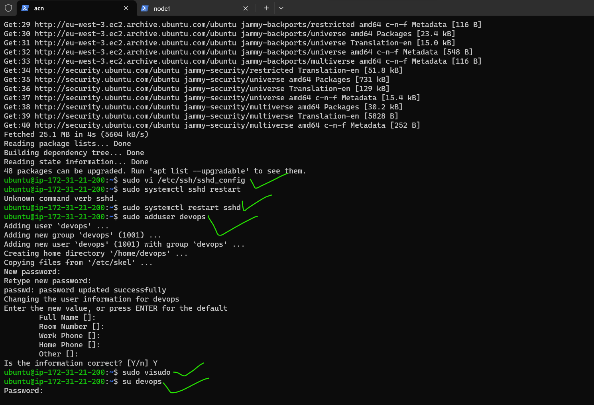
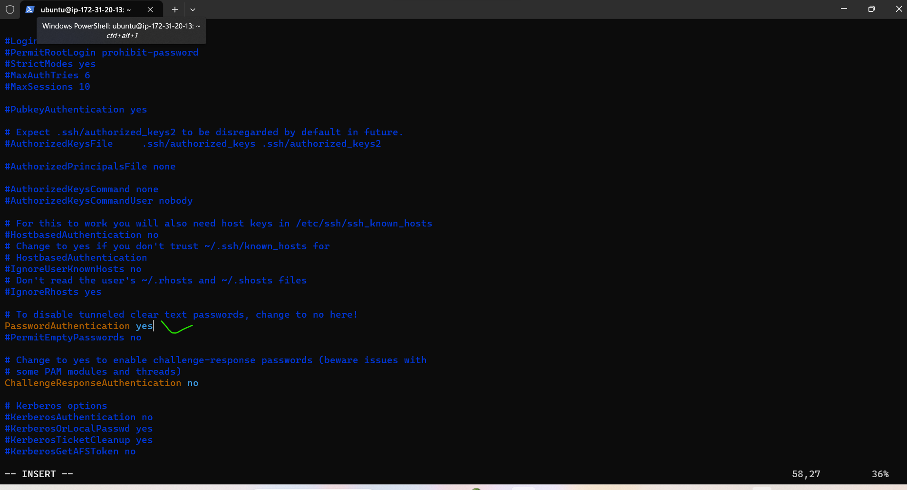
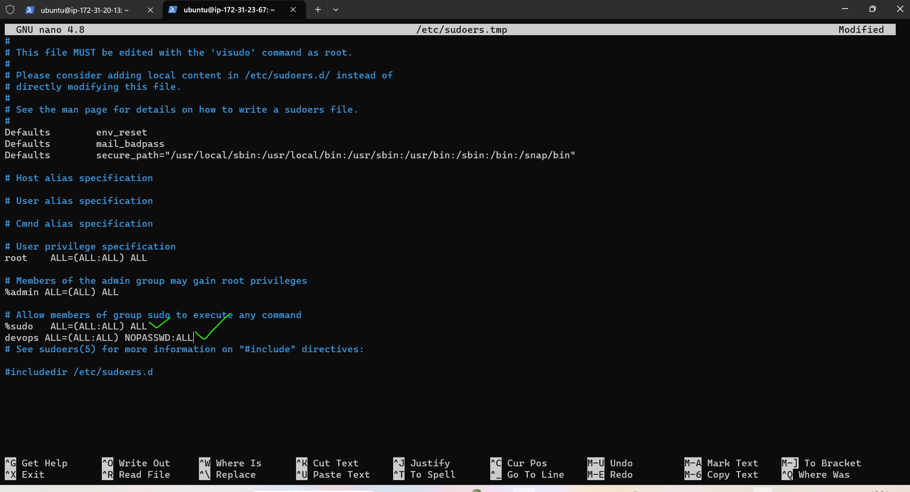
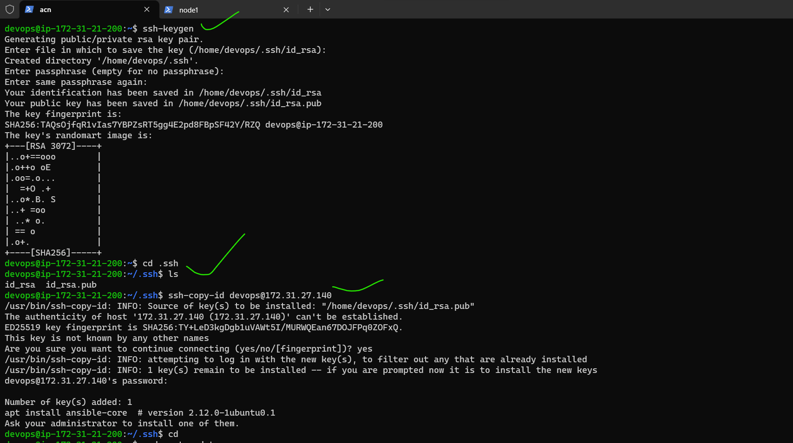

In ACN
-------

* After above process in ACN execute below commands in only ACN

```
su devops
ssh-keygen
cd .ssh
ls
cd 
```
* connect ACN to node1 commands are
```
ssh-copy-id username@anothernode privateIP address       
#like ssh-copy-id devops@172.31.14.123
ssh devops@172.31.14.123
echo 172.31.14.123(anothernode private IPaddress) > inventory 
#like this echo 172.31.14.123 > inventory
cat inventory
```
* Ansible Installation commands are
```
sudo apt update
sudo apt install software-properties-common
sudo add-apt-repository --yes --update ppa:ansible/ansible
sudo apt install ansible -y
ansible --version
```
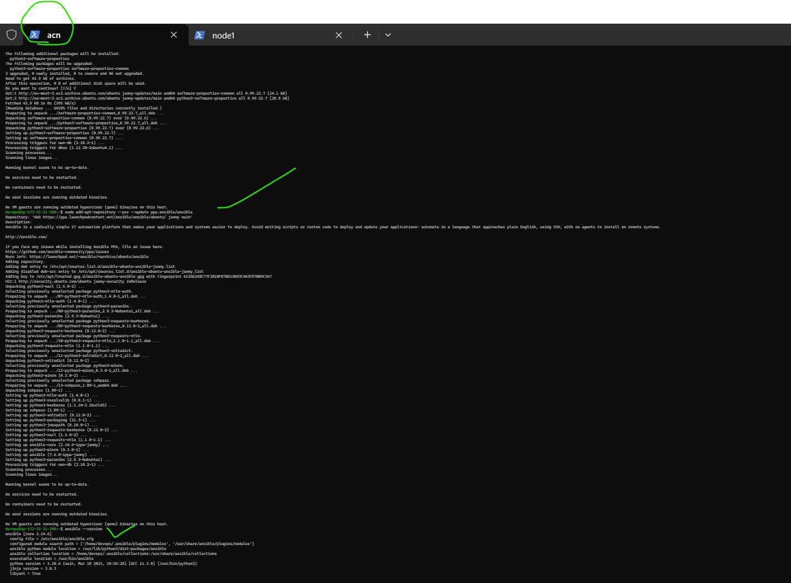
* To check the ansible inventory``ansible -i inventory -m ping all``if we have host``vi hosts`` && ``ansible -i hosts -m ping all``
* see previews

* In node 1 we can create only user and passwd authntication yes and give sudoers permission
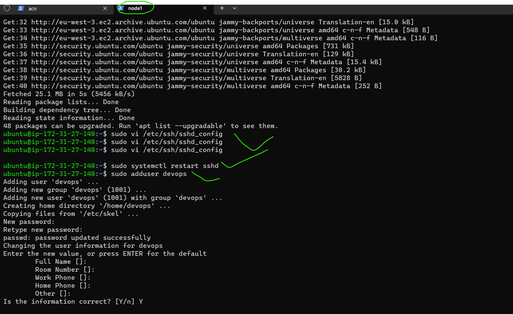

* For centOS also same process but commands are ``sudo yum update``

---------------------------------------------------------------------------------------------------------------------------------------

Task-2, 31-05-2023 and 01-06-2023
-------------------------------------------

1. Install apache,nginx and java11 manually and later with playbook.
* create 3 instances 2 are nodes for install apache and nginx this 2 are run on same port so we take 2 different nodes and in that only we do install java & 1 is ACN.
* write yaml files after that copy and paste it in ACN with names .yml(ex:apache.yml)

nginx:
------
* Install nginx on ubuntu manual commands are
```
sudo apt update
sudo apt install nginx
systemctl status nginx
```
* And copy the instance publicIP and paste it in new tab nginx page came.
* playbook for nginx
```yml
---
- name: install nginx on ubuntu
  hosts: all
  become: yes
  tasks:
  - name: install nginx
    ansible.builtin.apt:
      name: nginx
      update_cache: yes
      state: present
     
```
* And nodes private IP address paste in ``vi hosts``
* playbook syntax check with this command``ansible-playbook -i hosts --syntax-check nginx.yml``
* Run playbook with this command``ansible-playbook -i hosts nginx.yml``
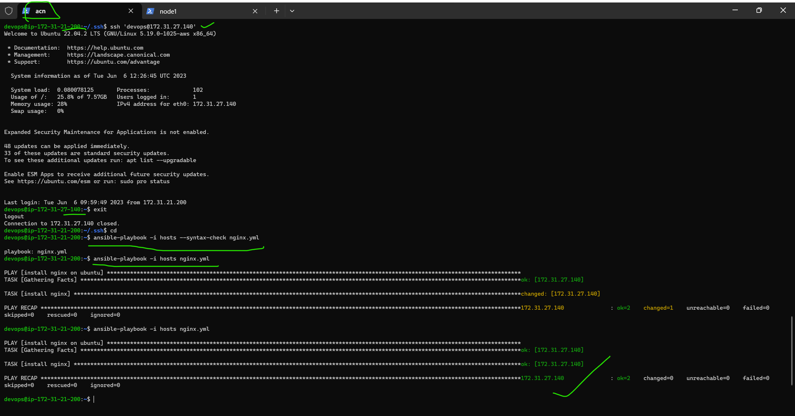
* copy another node publicIp and paste it in new tab then nginx page came
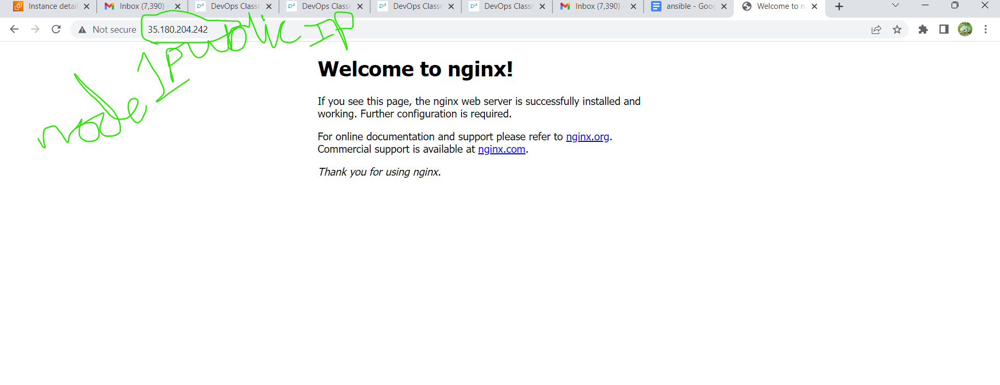

JAVA
----
* Install java on ubuntu manual commands are
```
sudo apt update
sudo apt install openjdk-11-jdk -y
java-- version
```
* playbook for java

```yml
---
- name: install java on ubuntu
  hosts: all
  become: yes
  tasks:
    - name: install java
      ansible.builtin.apt:
        name: openjdk-11-jdk
        update_cache: yes
        state: present                           
```
* First paste playbook``vi java.yml``&&``vi hosts``
* run the play book commands are same ``ansible-playbook -i hosts --syntax-check java.yml``&&``ansible-playbook -i hosts java.yml``
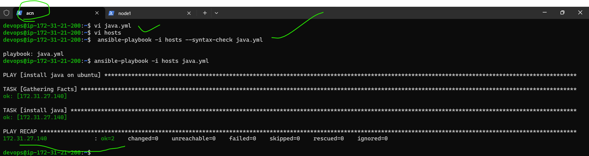
* check the java version in another node ``java--version``
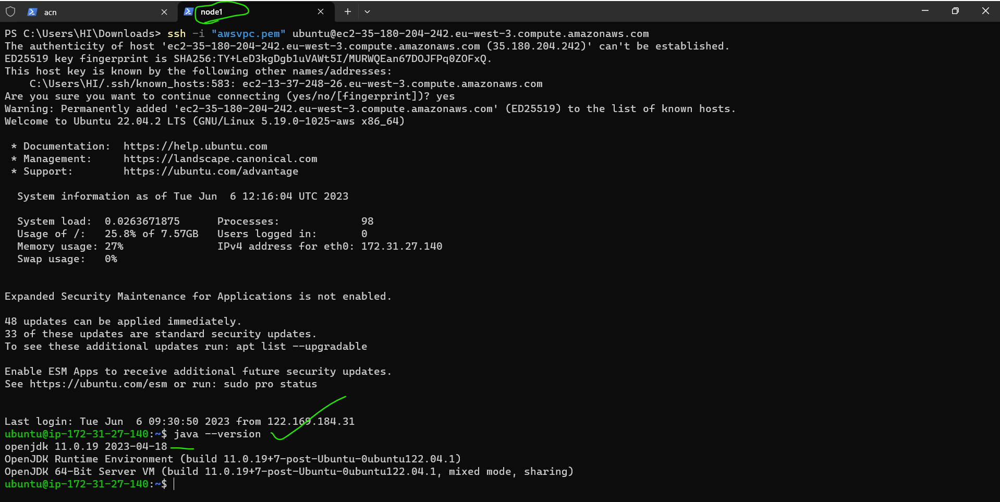

apache:
------
* Install apache2 on ubuntu manual commands are
```
sudo apt update
sudo apt install apache2
sudo systemctl status apache2
```
* And copy the instance publicIP and paste it in new tab apache page came.
* playbook for java
```yml
---
- name: install apache on ubuntu
  hosts: all
  become: yes
  tasks:
    - name: install apache2
      ansible.builtin.apt:
        name: apache2
        update_cache: yes
        state: present 
```

* First paste playbook``vi apache.yml``&&``vi hosts``
* run the play book commands are same ``ansible-playbook -i hosts --syntax-check apache.yml``&&``ansible-playbook -i hosts apache.yml``
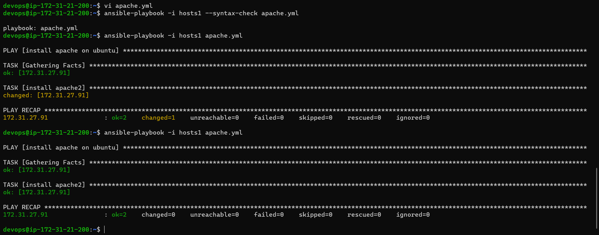
* copy another node publicIp and paste it in new tab then nginx page came
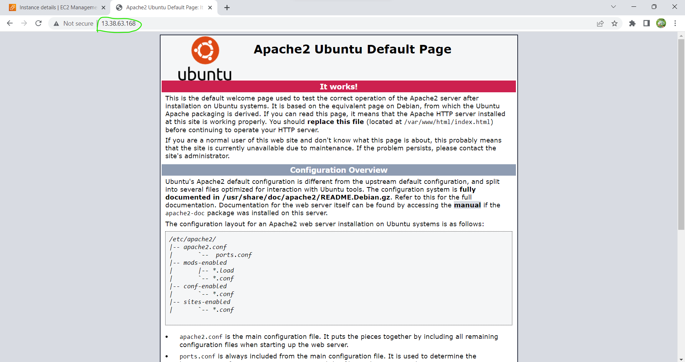


 
1. now write a playbook for each node to get php info page (you can use handler) 

Handlers: running operations on change
---------
* Sometimes you want a task to run only when a change is made on a machine. For example, you may want to restart a  service if a task updates the configuration of that service, but not if the configuration is unchanged. Ansible uses handlers to address this use case. Handlers are tasks that only run when notified.
[referhere](https://docs.ansible.com/ansible/latest/playbook_guide/playbooks_handlers.html#handlers)for the handlers documentation
* Install php with apache2 on ubuntu manual commands are
```
sudo apt update
sudo apt install php libapache2-mod-php
sudo systemctl restart apache2
```
* If install php with nginx on ubuntu manual commands are
```
sudo apt update
sudo apt install php-fpm
systemctl status php-fpm
```
* In this we used group variables also [referhere](https://github.com/asquarezone/AnsibleZone/blob/master/May23/inventory/group_vars/webserver.yaml) like this we used group variables.
 
* First I create another two nodes one is ubuntu and one is redhat(centos not connected so i can take redhat)
* After creating that two nodes connect and execute below commands
#For ubuntu
```
sudo apt update 
sudo vi /etc/ssh/sshd_config #passwd yes
sudo systemctl restart sshd
sudo adduser devops
sudo visudo
su devops
```
#For Redhat
```
sudo yum update 
sudo vi /etc/ssh/sshd_config #passwd yes
sudo systemctl restart sshd
sudo adduser devops
sudo passwd devops
sudo visudo
su devops
```
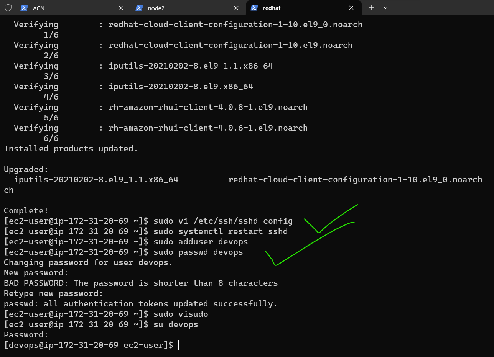

* In redhat password authntication remove# only 
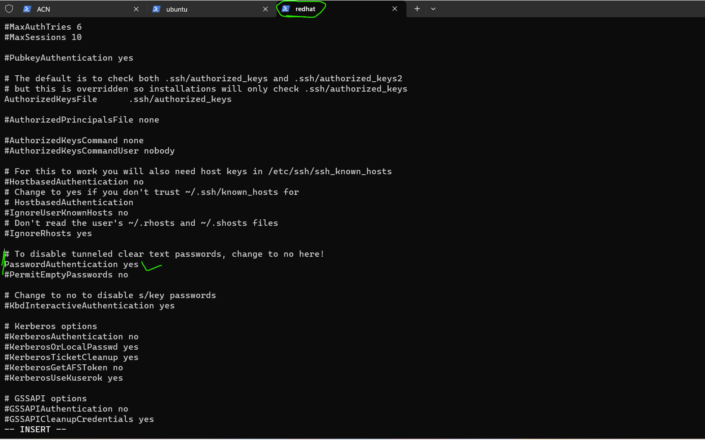
* After creating the devops user in two nodes then this nodes connected to the ACN with below commands
```
ssh-copy-id devops@<node privateIP>
ssh devops@<node privateIP>
exit
echo nodeprivateIP > inventory # if needed
cat inventory
```
* Next copy and paste the playbook and host files into ACN with``vi hosts``&&``vi <filename>.yml``ex``vi ubuntu.yml``
* vi hosts file
```yml
[ubuntu]
172.31.21.199
[redhat]
172.31.29.33

[webserver]
172.31.21.199
172.31.29.33

```
* vi redhat.yml
```yml
---
- name: install lamp server on ubuntu
  hosts: all
  become: yes
  tasks:
    - name: install apache2 server
      ansible.builtin.yum:
        name: httpd
        state: present
    - name: enable and start apache
      ansible.builtin.systemd:
        name: httpd
        enabled: yes
        state: started
    - name: install apache2 server
      ansible.builtin.yum:
        name: php
        state: present
      notify:
        - restart apache2
    - name: copy the info.php file
      ansible.builtin.copy:
        src: info.php
        dest: /var/www/html/info.php
      notify:
        - restart apache2
  handlers:
    - name: restart apache2
      ansible.builtin.systemd:
        name: httpd
        state: restarted                     
```
* vi ubuntu.yml
```yml
---
- name: install lamp server on ubuntu
  hosts: all
  become: yes
  tasks:
    - name: update packages and install apache
      ansible.builtin.apt:
        name: apache2
        update_cache: yes
        state: present
    - name: install php packages
      ansible.builtin.apt:
        name:
          - php
          - libapache2-mod-php
          - php-mysql
        state: present
      notify:
        - restart apache2
    - name: copy the info.php page
      ansible.builtin.copy:
        src: info.php
        dest: /var/www/html/info.php
      notify:
        - restart apache2
  handlers:
    - name: restart apache2
      ansible.builtin.systemd:
        name: apache2
        state: restarted
```
* vi info.php
```php
<?php phpinfo(); ?>
```
* Above all files paste in ACN
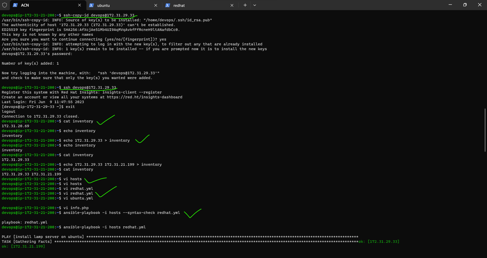
* Then check the playbook``ansible-playbook -i hosts --syntax-check redhat.yml``
* To run the playbook``ansible-playbook -i hosts redhat.yml``
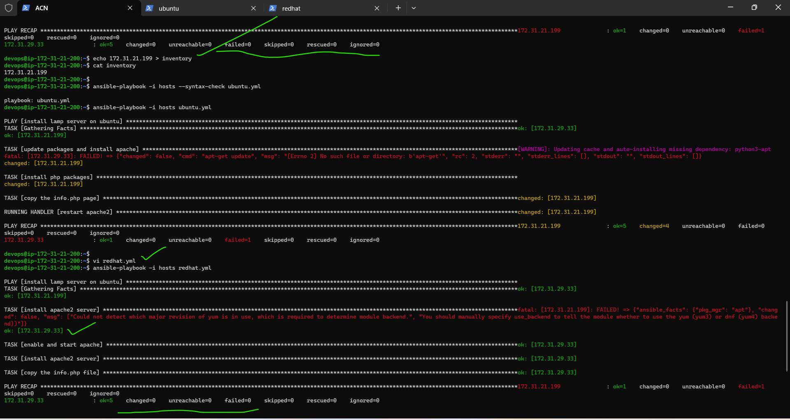
* Next change inventory file then execute ubuntu playbook
* Then check the playbook``ansible-playbook -i hosts --syntax-check ubuntu.yml``
* To run the playbook``ansible-playbook -i hosts ubuntu.yml``
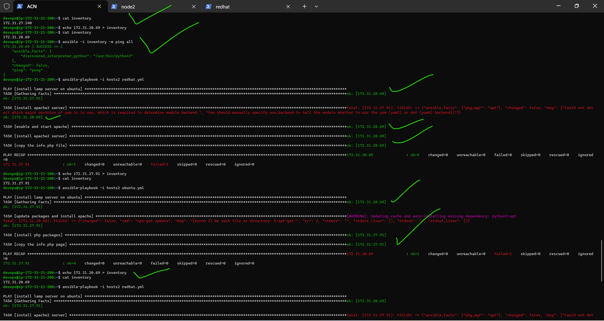
* After that copy the node publis IP and paste in newtab with /info.php then php page came
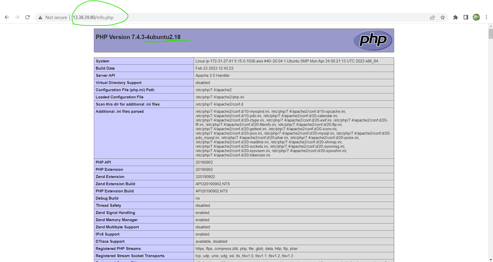
* Redhat publicIP copy and paste in newtab with /info.php
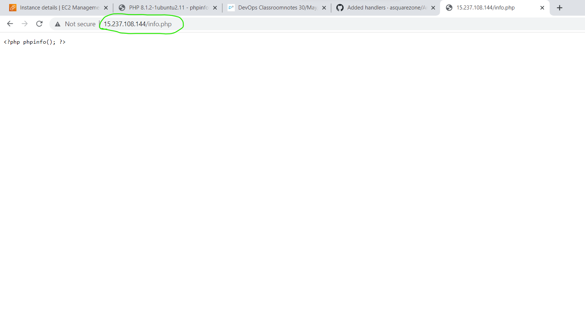
 
---------------------------------------------------------------------------------------------------------------------------------------
Task-3, 02-06-2023
-----------------------
 1. install metricbeat installation on ubuntu vm.(Manually)
* [refer here](https://www.elastic.co/guide/en/beats/metricbeat/current/setup-repositories.html)for documentation
* Same as it is follow above document


* use this command to configure the elastic search with local host``sudo vi /etc/metricbeat/metricbeat.yml`` in this edit cloudID and cloud auth see the preview7 in that cloud ID is there.
* password is in the credentials save it.
* If we want to reset password goto security it is below the deployments.

* Enable the nginx module``sudo metricbeat modules enable nginx``

2. install metricbeat installation on ansible nodes by playbook.
----------------------------------------------------------------------------------------------------------------------------------------
## To install metricbeat in ansible 
```yml
---
- name: installing metricbeat
  hosts: all
  become: yes
  tasks:
    - name: metricbeat install
      apt_key:
        url: https://artifacts.elastic.co/GPG-KEY-elasticsearch
        state: present
    - name: installing trasport https
      ansible.builtin.apt:
        name: apt-transport-https
        update_cache: yes
        state: present
    - name: Save the repository definition to path
      ansible.builtin.shell:
        cmd: echo "deb https://artifacts.elastic.co/packages/8.x/apt stable main" | sudo tee -a /etc/apt/sources.list.d/elastic-8.x.list
    - name: Save the repository definition to path
      ansible.builtin.shell:
        cmd: echo "deb https://artifacts.elastic.co/packages/oss-8.x/apt stable main" | sudo tee -a /etc/apt/sources.list.d/elastic-8.x.list
    - name: installing metricbeat
      ansible.builtin.apt:
        name: metricbeat
        update_cache: yes
        state: present
    - name: enable metricbeat
      ansible.builtin.service:
        name: metricbeat
        enabled: true
        state: started

```        
Task-4, 03-06-2023
-----------------------
 1. install NOPCommerce Manually.
 2. write a playbook for NOPCommerce and make it install on nodes.
----------------------------------------------------------------------------------------------------------------------------------------
Task-5, 04-06-2023
-----------------------
 1. Install the below applications manually.
    1. Broadleaf
    2. OpenMRS[referhere](https://masabagerald.medium.com/how-to-install-openmrs-in-ubuntu-server-20-04-826b5d727c6)
 2. After successful Installations of above applications write playbooks execute them.
---------------------------------------------------------------------------------------------------------------------------------------